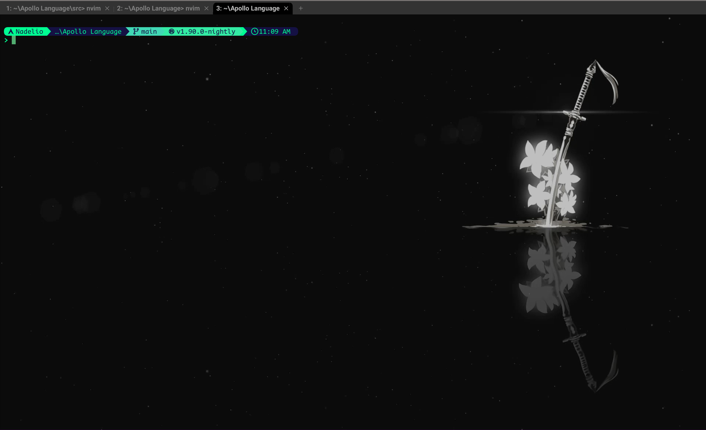
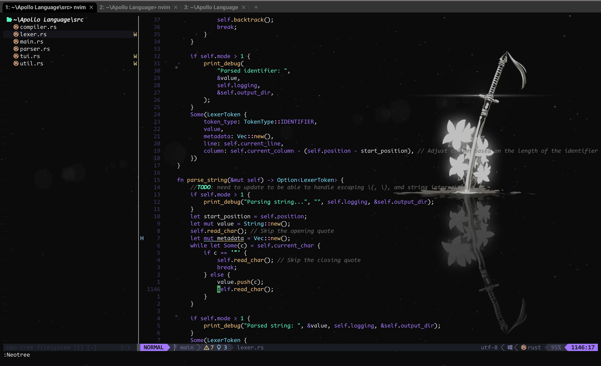

# Dotfiles

A simple and clean config for Linux users with a heavy lean on cyberpunk-esc colors and NieR: Automata theming

Software | Using
---------|------
Shell | Nushell
Terminal | Wezterm
Editor | Neovim

Various dependencies:
- Starship (prompt)
- Rust (various)
- GCC compiler (nvim-treesitter)
- Lua (bundled with nvim, but also is relied on by certain nvim plugins)
- Fira Code Mono (font, used by 90% of the terminal as the NerdFont)

# Setup
- Download Wezterm
- Download Nushell
- Plant these configs in the respective folders (90% of them just go in ~/.config, but it changes for Windows, and nushell can have a different config path)
- verify that config paths match up with your system, currently the configurations are set to work with Windows atm, so be sure to change that if you are on Linux systems
  - check [in wezterm config](wezterm/wezterm.lua#L10)
  - check [in nushell config](nushell/config.nu#L20)
  - check [in starship plugin config](nushell/vendor/autoloastarship.nu#L8)
- boot up wezterm
- If the background is 2B's sword and the starship prompt shows, then wezterm is setup correctly
- Type `ls`, if a fancy box shows up instead of the usual list of directories, the nushell is setup correctly
- Type `config nvim`, if nvim opens with no error, type `:PlugInstall`, then `q`, then `:so`, if there are no errors, then nvim is working
- Now enjoy my configuration! \:D
